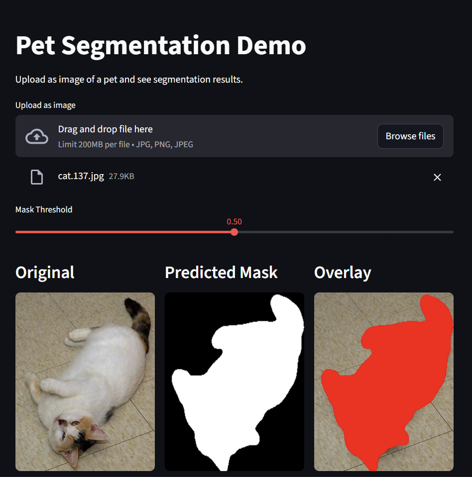
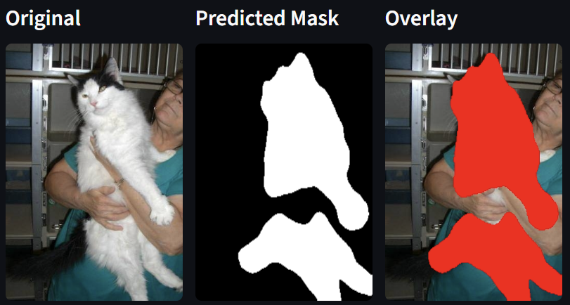
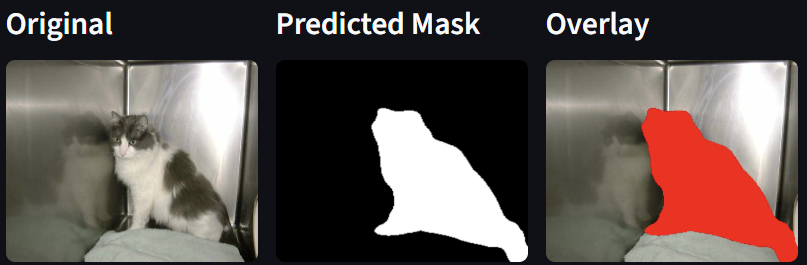
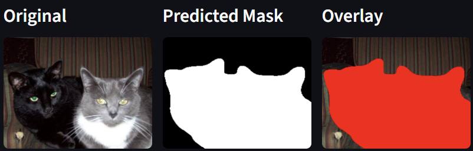
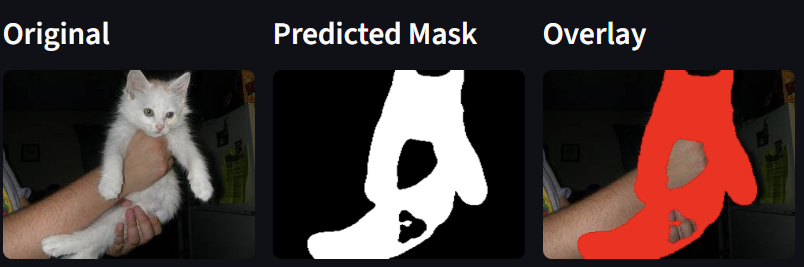
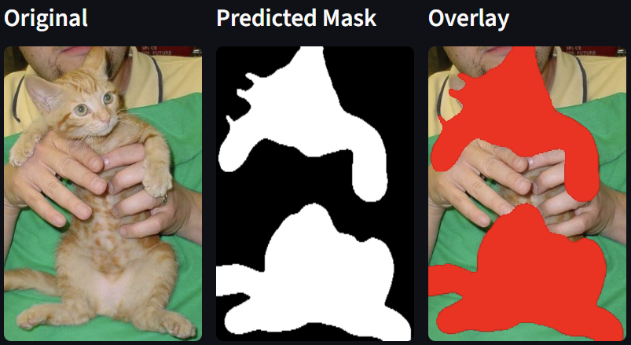
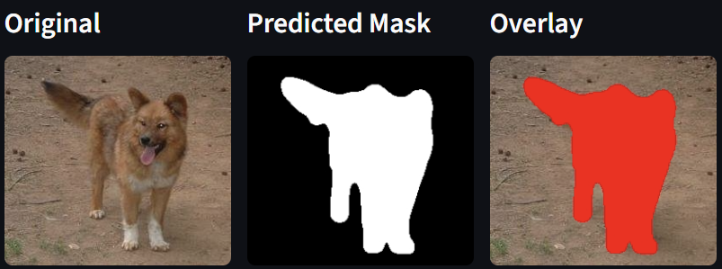
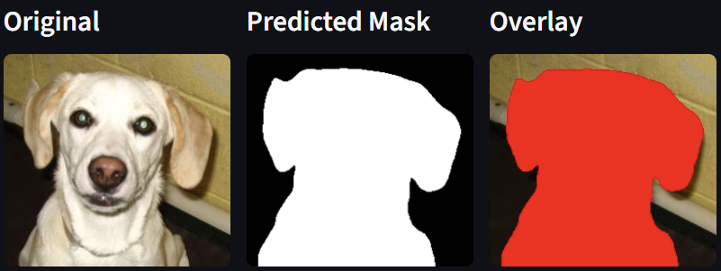

# 🐾 Pet Segmentation with U-Net & Transfer Learning

An end-to-end semantic segmentation project for pet foreground extraction using U-Net and transfer learning (ResNet-34 encoder) built with PyTorch and deployed via Streamlit.

This project demonstrates a complete computer vision workflow:
- Exploratory Data Analysis (EDA)
- Data cleaning & preprocessing
- Baseline U-Net
- Transfer Learning U-Net (ResNet-34)
- Quantitative & qualitative evaluation
- Deployment-ready inference pipeline

---

## 🚀 Live Demo (Streamlit Cloud)

🔗 **Try the app here:**  
[https://pet-segmentation.streamlit.app/](https://pet-segmentation.streamlit.app/)

The application allows users to:
- Upload a pet image
- Generate segmentation mask
- Visualize overlay results
- Adjust prediction threshold

---

## 🖼 Screenshots

### 🔹 App Interface


### 🔹 Prediction Example









---

## 🧠 Model Performance

### Transfer Learning U-Net (ResNet-34 Encoder)

- **IoU:** ~0.91
- **Dice Score:** ~0.95
- Two-phase training:
  - Warm-up (frozen encoder)
  - Fine-tuning (unfrozen encoder)

The transfer learning model significantly improves:
- Boundary precision
- Thin structure segmentation
- Occlusion handling

---

## 📂 Project Structure

```markdown
repo-root/
│
├── notebook.ipynb # Training & experimentation
│
├── streamlit-app/
│ ├── app.py # Main Streamlit application
│ ├── model.py # Model loading logic
│ ├── utils.py # Preprocessing & inference utilities
│ ├── requirements.txt # App dependencies
│ │
│ └── models/
│   └── best_unet_resnet.pth # Trained model weights
│
├── screenshots/
│ ├── app_ui.png
│ └── prediction_example.png
│
└── README.md

```
---

## 🛠 Tech Stack

- Python
- PyTorch
- segmentation-models-pytorch
- Albumentations
- OpenCV
- Streamlit
- NumPy
- Matplotlib

---

## ⚙️ Run Locally

### 1️⃣ Clone Repository

```bash
git clone https://github.com/yourusername/repo-name.git
cd repo-name/streamlit-app
```
### 2️⃣ Install Dependencies

```bash
pip install -r requirements.txt
```

### 3️⃣ Run App

```bash
streamlit run app.py
```

👤 Author

Hrishikesh Gaikwad | 
AI & Machine Learning Engineer